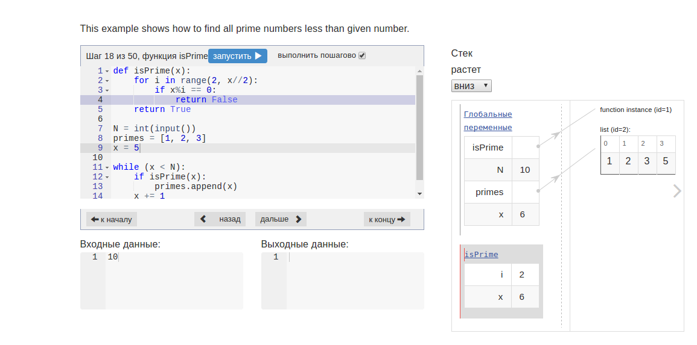

# Python visualizer for gitbook
## Origins
This is a python visualizer ported from [pythontutor.ru](http://pythontutor.ru) 
(it also has [international version](http://snakify.org)). 
Sources can be found on [git](https://github.com/pythontutor/pythontutor-ru).

This plugin is running now using backend server (for python executing) hosted by me.
I don't guarantee that it will be working all time. If you want, you can start your server using //TODO sources.
This is not complicated, all you need is `python3` and `bottle` package. 

I have in plans to port this to pure JS (like Brython) to run it with browser only, please contribute if you like.



## Usage

Usage is quite simple, just let your `book.json` have
```
{
  "plugins": ["python-visualizer"]
}
```
and insert to your `.md`
```


```
Or
```

# Put your code here!
# And watch visualisation line by line!
x = 1
for i in range(1, 10):
    x *= i
print("10! =", x)

```
## Features
* Feel free to create several visualizers on one page.
* Your code will also stay while you're going to another pages!
